# Projects
- [Data and Python](#data-and-python)
- [Arduino and electronics](#arduino-and-electronics)
- [3D modeling](#3d-modeling)
- [Metalworking](#metalworking)
- [Woodworking](#woodworking)
- [General Product design](#general-product-design)
- [Office Suit](#office-suit)
- [Data analytics](#data-analitics)

# Data and Python
### Pima diabetes
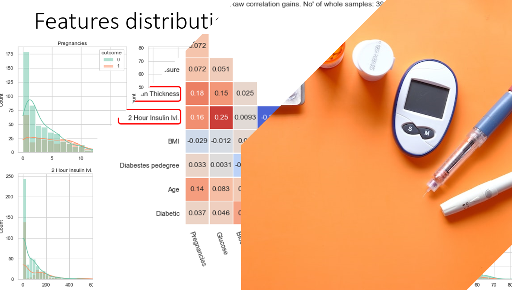

_19/9/2019_
**What?**
* Creating a predictive model for diabetes in the Pima community

**How?**
* Dataset from Kaggle
* Python tools - jupyter lab, pandas, sklearn, seaborn
* A variety of models and methods

**Results**
* Model accuracy of 0.813
* Reaching unique conclusions regarding the subjects of the data

take a look at the [github page of the project](https://github.com/dodomarg/pima-diabetes)

# Arduino and electronics

## GSR bracelet - electro dermal activity accusation prototype
| Sensor assembly | Bracelet | Complete system |
| ----------- | ----------- | -- |
| 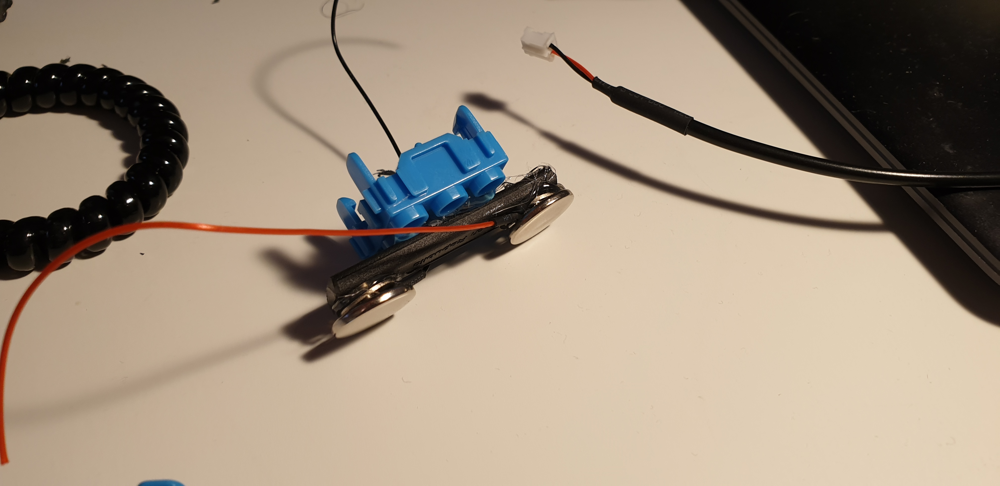 | 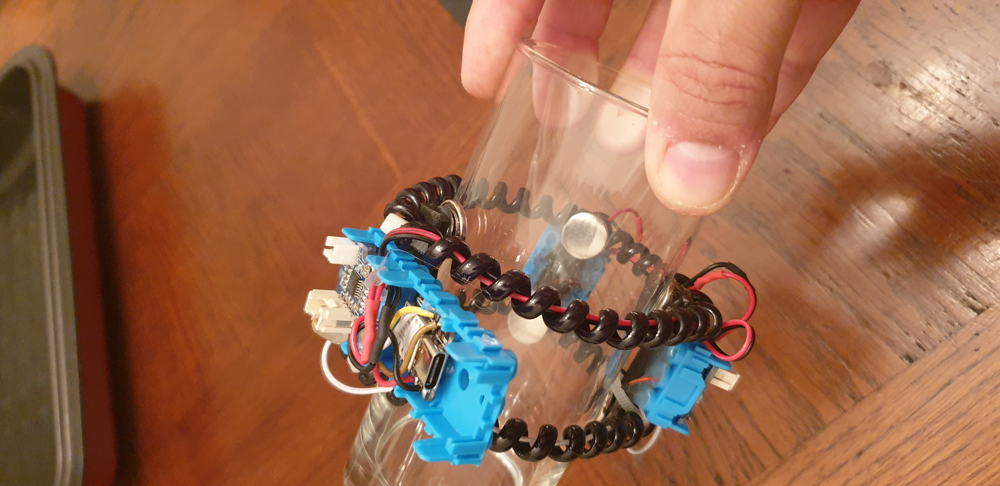 |  |

_05/11/2020_
**What?**
* Revise and execute a prototype bio feedback bracelet for a startup company (BioPal)
* Must easily fit different wrist sizes, must maintain relative placements of dermal sensors
* Easy to operate and easy to export data for analysis
* Stable sample rate of 500 Hz

**How?**
* Arduino compatible board with RTOS based firmware
* Raspberry Pi with python driver for data logging and control

**Results**
* Client was highly pleased with design and deployed the prototype for further R&D

## RGB night light

_05/03/2021_

|Circuit design|Mockup|Final product|
|--|--|--|
|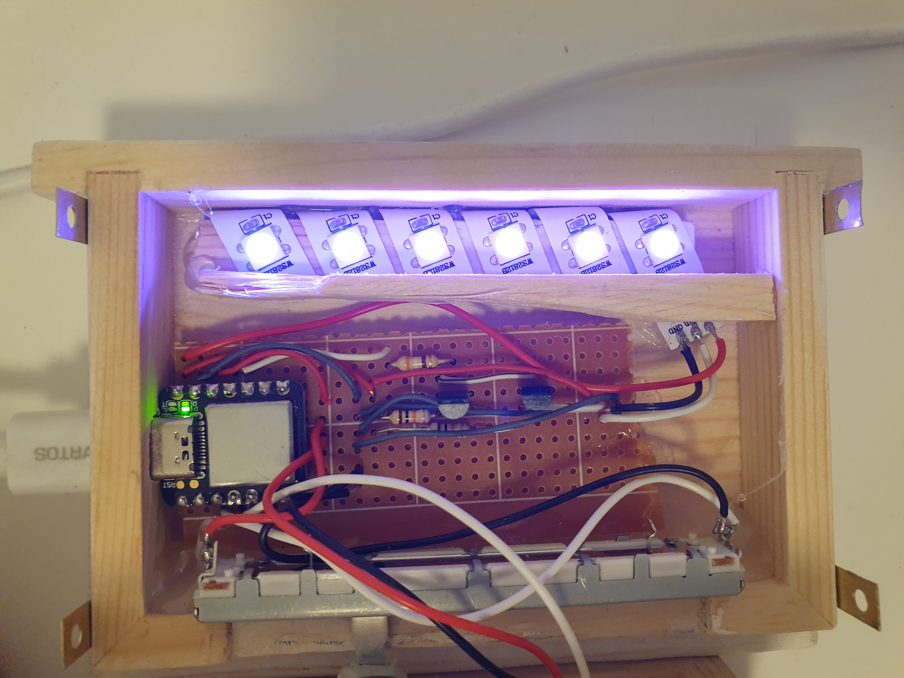|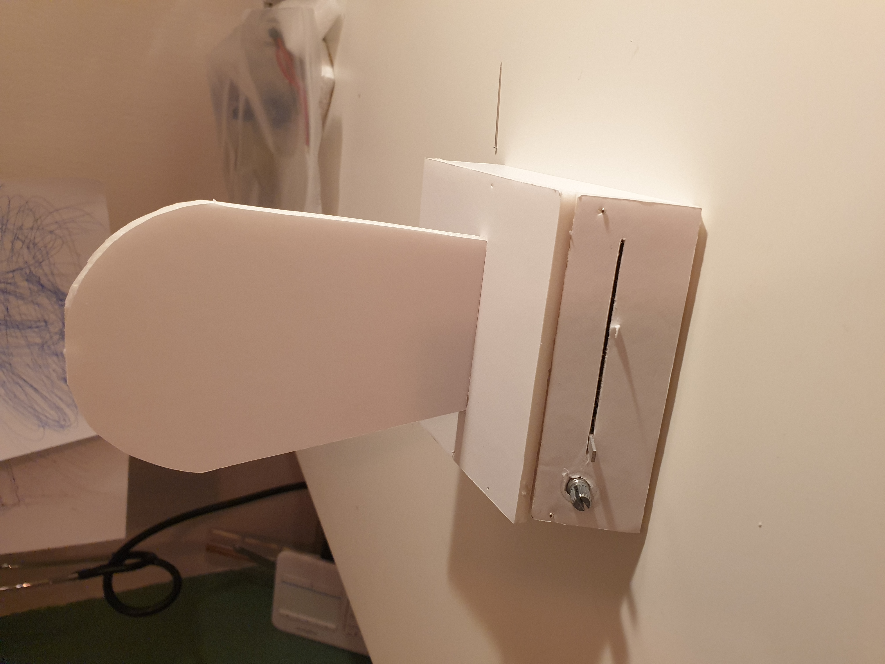|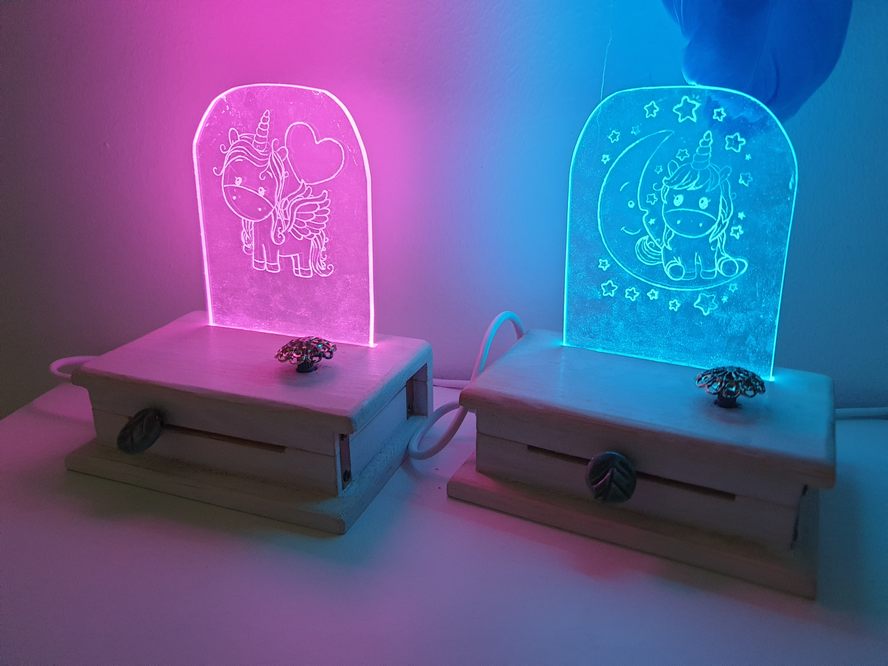|

**What?**
* Create an awesome gift for my 2 & 5 year old nieces
* A easy to operate 
* Interactive light color and intensity control
* A rustic design

**How?**
* Arduino, WS2812B led's and 3.3v to 5v logic level shifter
* Linear and Rotational potentiometers for control in HSL pallet controlling hue and luminance
* Hand made woden enclosure and hand engraved plexiglass

**Results**
* Best uncle of 2021 award!

## Bios dump 

_30/04/2022_

| Leads attached to motherboard | Reading bios dump|
|--|--|
|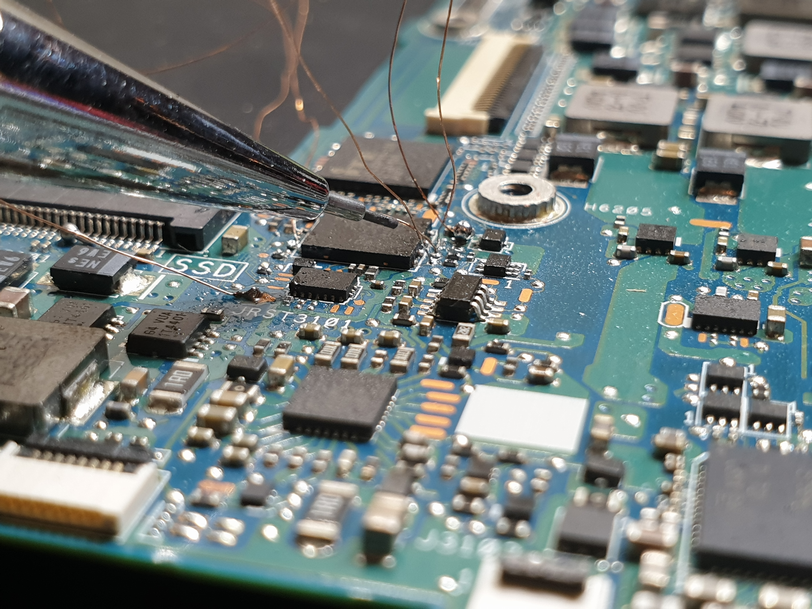|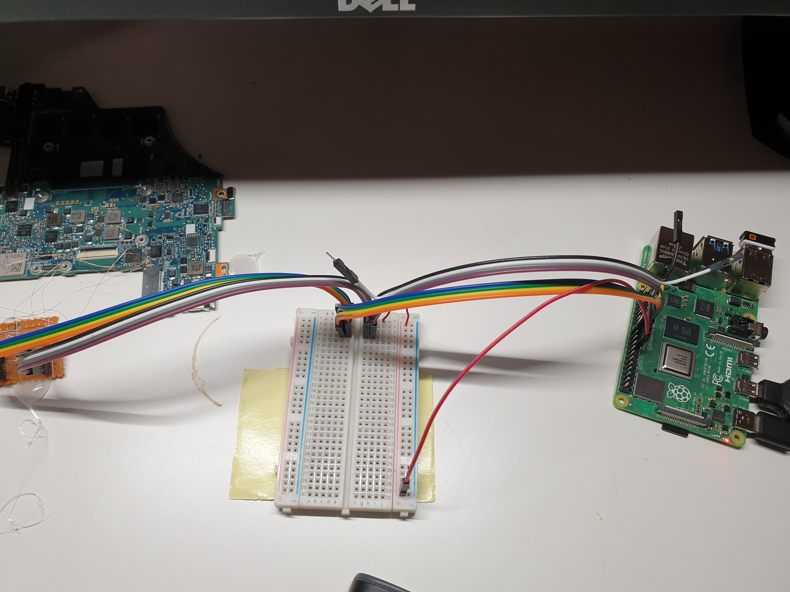|

**What?**
* Recovering a bios password of a laptop
* Main challenge - bios chip is WSON form factor
* Motherboard leads exist but some are 0.3 mm dia

**How?**
* Consulting with fellow makers
* Reading the chips data sheet
* Soldering ultra thin copper leads to Motherboard
* RaspberryPi for SPI communication with bios chip
* Online resource for decrypting bios dump - badcaps.net/forum

**Results**
* Password was obtained after 6 hours of work 
* Device was successfully rebooted and put back to work 

# 3D modeling

## Plastic enclosure design

_21/06/2022_

|1st Rev.| 2nd Rev. topology optimization| 2nd Rev. Render|
|--|--|--|
||||

**What?**
* Designing a novel scale incorporating some smart features! 
* High weight limit of 10kg
* Design and crate an attractive enclosure
* General design inspiration - 90' Mazda MX-5

**How?**
* Iterative design
* Fusion 360 CAD
* Static stress simulations 

**Result**
* Design exceeding a safety factor of 2
* Sent out for production
* Projected cost reduced by 50% over design iterations 

## Interior design simulation

_11/12/2014_

|Option A| Option B|
|---|---|
|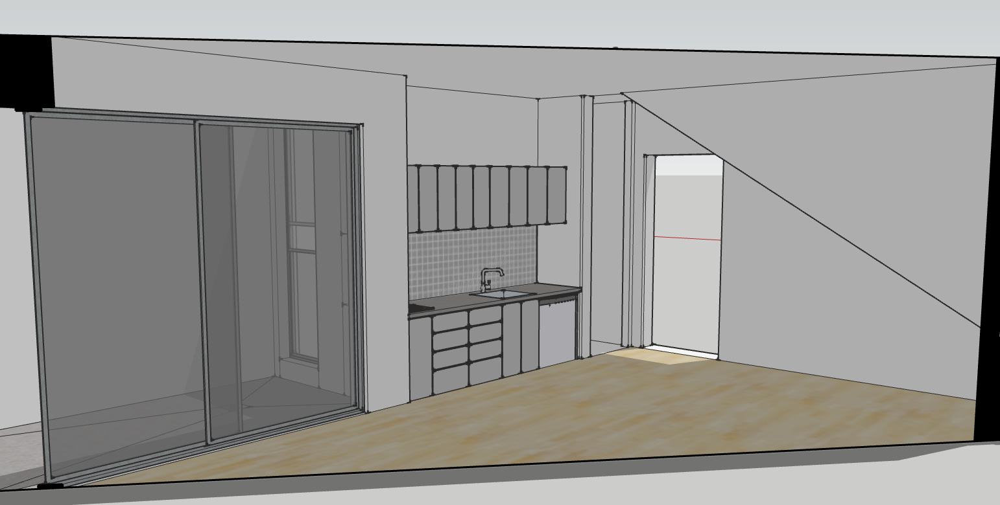|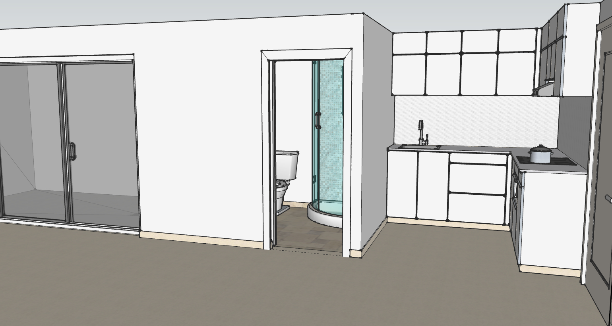|

**What?**
* Create a simulation of a small apartment from building plans
* Explore different design concepts and layouts.

**How?**
* Sketchup modeling
* Extracting sizes from 2D scale construction plans

**Results**
* A powerful tool for decision making prior to construction.

# Metalworking

## Shade sails 

_10/07/2020_

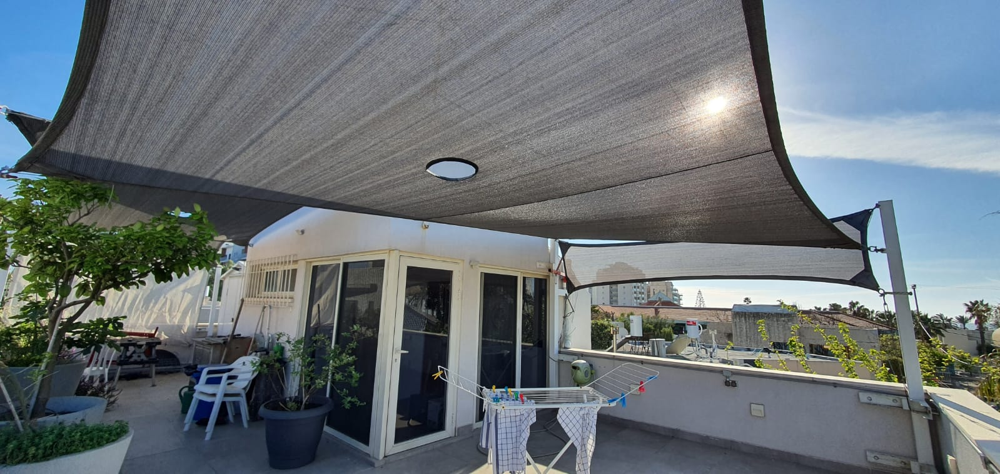

**What?**
* Covering a 50 sqm rooftop with shade sails
* Withstand strong winds up to 80 k/h

**How?**
* Fabricating and mounting 7 steel box section masts on existing infrastructure  
* Supplying custom sized shade sails and wind braker curtins
* Fabricating custom low profile cable tensioners  

**Results**
* A well shaded rooftop that withstands strong winds and rain
* high shade coverage thanks to low profile tensioners and vertical wind braker curtins

## Electric hoist winch

_11/12/2021_

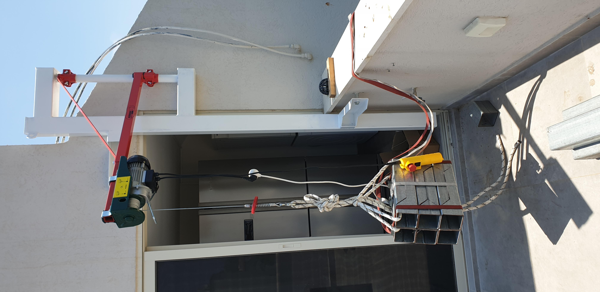

**What?**
* A reliable mean to lift equipment up to the roof of the house from the garden level to a hight of 10 meters
* modest payload capability of 75 kg
* must be serviceable 

**How?**
* Electric hoist winch mounted on a self fabricated and mounted pole
* Chemical masonry anchors for maximal safety and strength  

**Results**
* Design and execution stands the requirement
* Passed strain test of x4 of the required payload (250kg) 

## BBQ grill gas to charcoal conversion 

_16/04/2021_

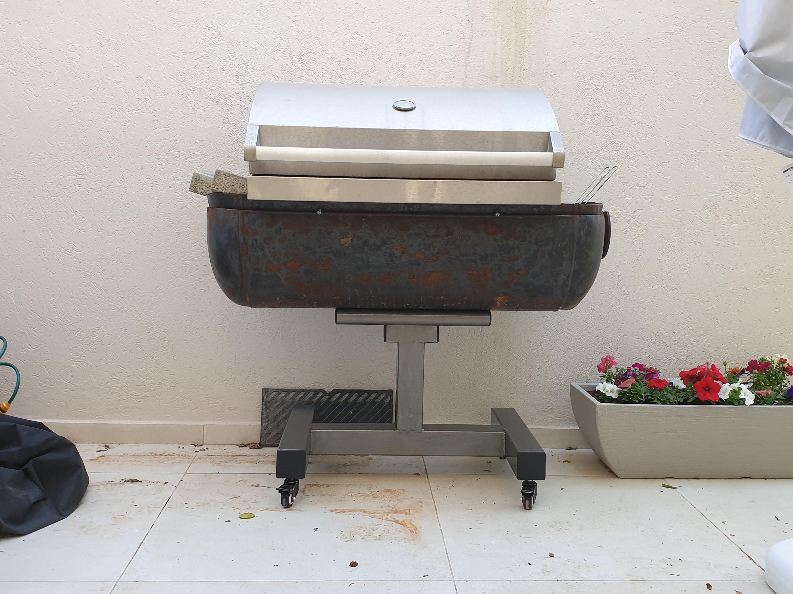

**What?**
* Converting an unusable stainless steel grill to work with charcoal  

**How?**
* Modifying grill body and a water heater to serve as basin
* Custom rolling base with steel box sections and tube

**Results**
* A unique grilling experience and grate food

# Woodworking

## Clothing valet - a rack for personal daily clothing 

_2/11/2015_

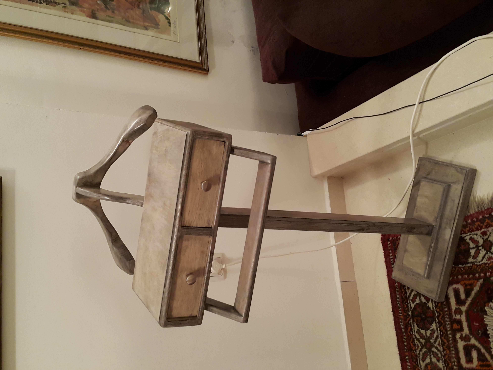

**What?**
* A bespoke furniture item made of birch plywood
* Capable of storing a dress shirt, jacket, pants and personal items 

**How?**
* **Sketchup** 3D design of the item.
* Self manufactured from a to z 

**Results**
* A wonderful pice of furniture still in use today

# General Product design

## Bicycle front cargo rack

_11/12/2021_

**What?**
* Front cargo rack for bicycle fork
* Stylish appearance and with high payload
* Mount without modifying bicycle frame 

**How?**
* Stainless steel sheet metal and mounting hardware
* Wooden surface with weatherproof varnish and undercoating

**Results**
* Strong and functional front rack.
* Cutouts in sheet metal serve both functional and esthetic purposes  

## Shaving stand

_28/01/2015_

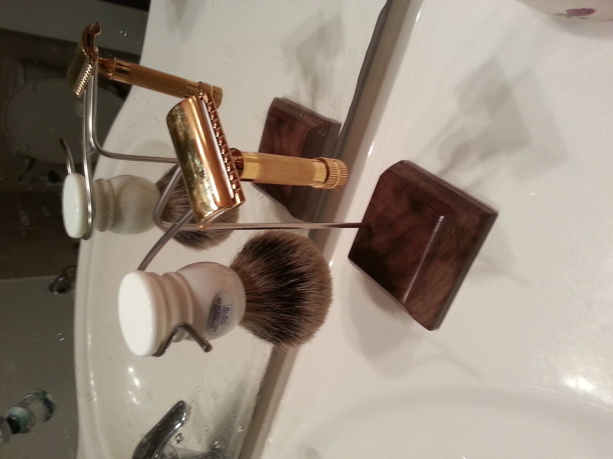

**What?**
* A close razor helps a close shave
* Inverted brush is high and dry

**How?**
* Some african walnut and a 316L SS 3.2 mm TIG rod
* Table saw, Dremel and varnish 

**Results**
* A clean setup for a clean shave

## Shop vac dust separator

_01/02/2015_

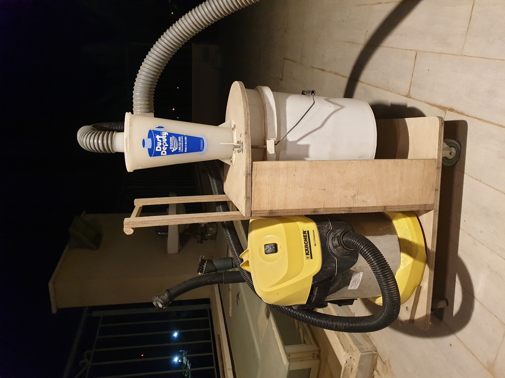
**What?**
* Dust separator for existing shop vacuum cleaner
* Must maintain constant operation under load and prevent loss of suction when exposed to fine dust

**How?**
* Sourcing a cyclone separator
* Building a custom trolly 

**Results**
* Effective performance under heavy use in construction and carpentry applications
* Sucking power maintained for 10x longer over unmodified vacuum cleaner  

# Office Suit 

## Maritime sector M&A report

_08/04/2019_

**What?**
* Drive interest in the maritime sector
* M&A research in the maritime industry
* Create a compelling slide for sharing on social media

**How?**
* Search engines, advance searches and search alerts
* Excel for data analytics
* Power Point for creating visual

**Result**
* Providing the customer with quality knowledge and new insights
* High engagement with the publications online

## Work logbook

_01/02/2018_

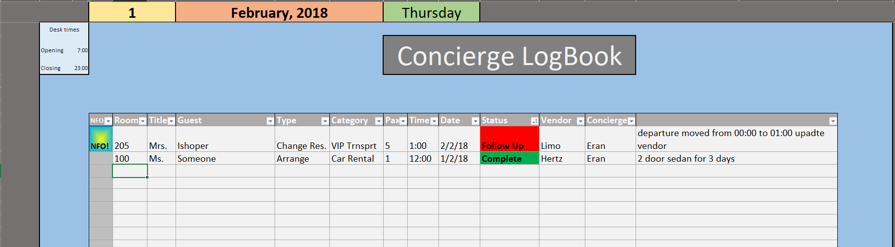

**What?**
* A task management tool for teamwork
* Daily tasks and monthly reports
* Must be based on existing tools in the workplace

**How?**
* Excel workbook

**Results**
* An effective tool for the task
* Adoption of a similar tool by other departments

